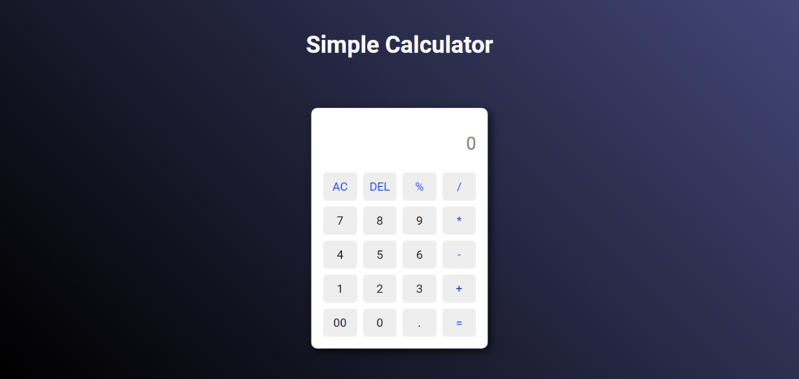

# simple-calculator

## Description

A simple calculator project with simple mathematics operators.

## Demo

You can try it out [here](https://eliasdewa14.github.io/simple-calculator/)

## How was it built?

* This was built using HTML, CSS, and vanilla JavaScript.

## How to use

* Clone from Github
* Make any changes that you like
* Open `index.html` and try it out

## Contributing

Pull requests are welcome. For major changes, please open an issue first
to discuss what you would like to change.

## License

[MIT](https://choosealicense.com/licenses/mit/)
